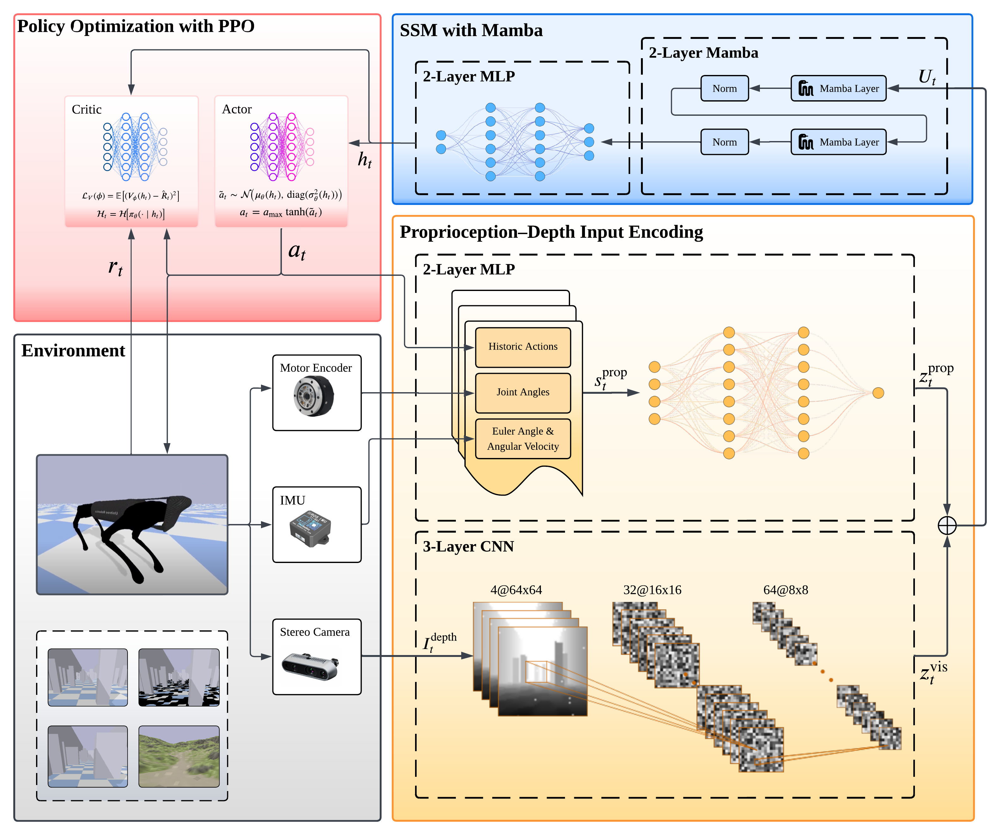

# locomamba

The source codes of "LocoMamba: Vision-Driven Locomotion via End-to-End Deep Reinforcement Learning with Mamba".

The code and data processing scripts of this work are coming soon after this work is published.

# Supplements

- Video that shows the LocoMamba performance on trained terrain and 2 unseen challenging complex terrains.

  **Click to view the video:**

  

# Architecture

  
